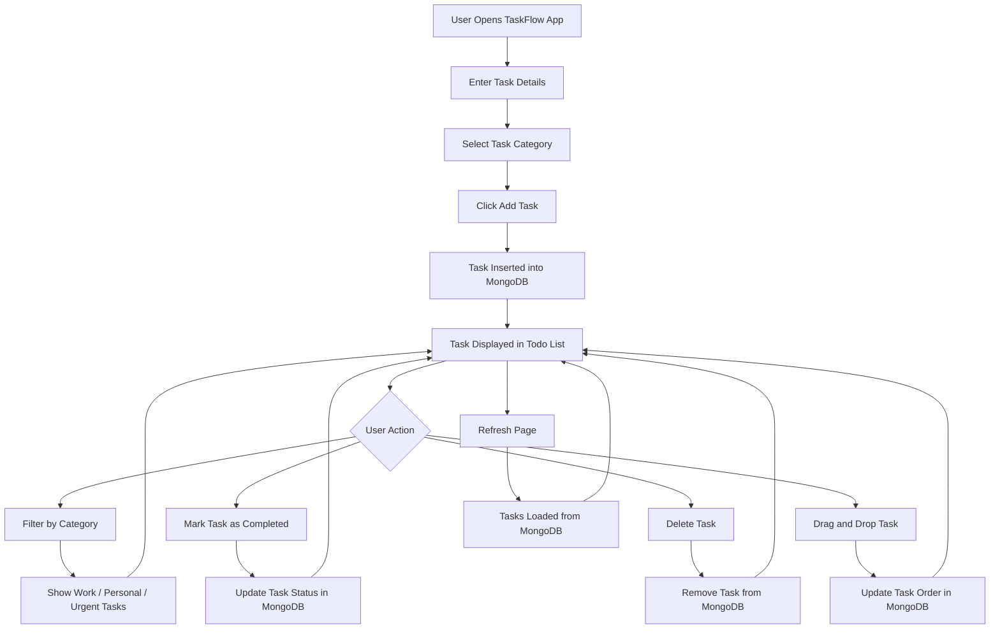

# TaskFlow - Meteor Blaze Todo App

TaskFlow is a simple and interactive to-do application built using **Meteor.js** and **Blaze**. The application allows users to create, organize, filter, complete, delete, and reorder tasks.

This project is based on the Meteor Blaze Simple Todos tutorial and includes additional enhancements such as task categories and drag-and-drop reordering.

## Features

* Add new tasks
* Categorize tasks as Work, Personal, or Urgent
* Filter tasks based on category
* Mark tasks as completed
* Delete tasks
* Reorder tasks using drag-and-drop
* Save task order persistently using MongoDB
* Responsive and clean user interface

## Enhancements Implemented

### 1. Task Categories

Each task can be assigned a category while creating it. The available categories are:

* Work
* Personal
* Urgent

Users can also filter tasks based on these categories.

### 2. Drag-and-Drop Reordering

Tasks can be reordered by dragging them using the drag handle. The updated order is saved in MongoDB, so the order remains the same even after refreshing the page.

## Tech Stack

* Meteor.js
* Blaze
* MongoDB
* JavaScript
* HTML
* CSS
* SortableJS

## Project Structure

```text
taskflow-meteor-todo
├── client
│   ├── main.html
│   ├── main.js
│   └── main.css
├── imports
│   ├── api
│   │   └── TasksCollection.js
│   └── ui
│       ├── App.html
│       ├── App.js
│       ├── Task.html
│       └── Task.js
├── server
│   └── main.js
├── package.json
├── package-lock.json
└── README.md
```
## Application Flowchart


## How to Run the Project

### 1. Clone the repository

```bash
git clone <repository-url>
cd taskflow-meteor-todo
```

### 2. Install dependencies

```bash
meteor npm install
```

### 3. Install required package

```bash
meteor npm install sortablejs
```

### 4. Add required Meteor package

```bash
meteor add reactive-var
```

### 5. Run the application

```bash
meteor run
```

Open the app in your browser:

```text
http://localhost:3000
```

## Usage

1. Enter a task in the input field.
2. Select a category: Work, Personal, or Urgent.
3. Click the Add Task button.
4. Use category filter buttons to view tasks by category.
5. Use the checkbox to mark a task as completed.
6. Use the delete button to remove a task.
7. Drag tasks using the drag handle to reorder them.

## Assignment Details

This application was developed as part of a Meteor.js Blaze assessment. The base functionality follows the Meteor Blaze Simple Todos tutorial, with additional enhancements added to demonstrate practical usage of Meteor, Blaze templates, MongoDB collections, and client-server interaction.
